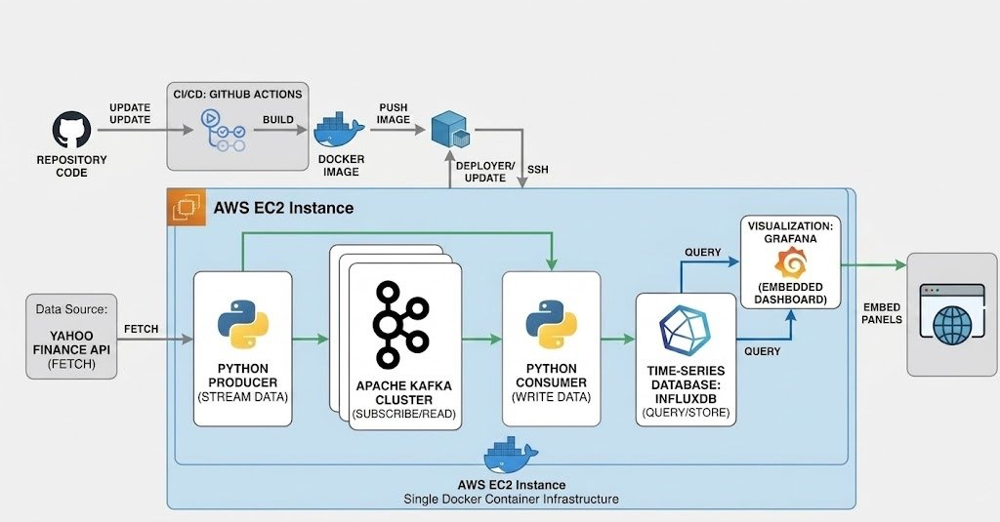

# 📈 Real-Time Finance Dashboard

## 📌 Project Overview
This project is an end-to-end, real-time data engineering and quantitative analytics platform. It continuously monitors global macro-economic indicators—specifically Bitcoin (BTC), Gold, Silver, and the US Dollar Index (DXY). 

The system leverages an event-driven architecture, streaming live market data asynchronously via Apache Kafka, storing it in a high-performance time-series database (InfluxDB), and visualizing it through a custom-built quantitative Grafana dashboard. The entire infrastructure is containerized and automatically deployed to an AWS EC2 production environment via GitHub Actions.

## 🚀 Key Features
* **Event-Driven Streaming Pipeline:** Decoupled Python Producer and Consumer microservices communicating reliably via an Apache Kafka message broker.
* **Quantitative Analytics Engine:** Beyond simple data display, the Grafana dashboard features:
  * Dynamic threshold alerts for the Gold/Silver ratio.
  * Moving Average (SMA) crossovers for trend detection.
  * A rule-based **Market Regime detection algorithm** (Bullish/Bearish) utilizing Grafana Math Expressions.
* **Automated CI/CD:** A GitHub Actions workflow automatically builds and deploys the Docker Compose stack to the AWS EC2 instance upon every push to the `main` branch.
* **Production-Ready Web Integration:** The dashboard is served securely via a Caddy reverse proxy (HTTPS) and seamlessly embedded into a professional portfolio website using Grafana's Kiosk mode.

## 🏗️ Architecture



1. **Data Ingestion:** A Python Producer fetches real-time ticker data from the Yahoo Finance API (`yfinance`).
2. **Message Broker:** The data is serialized into JSON and pushed to an **Apache Kafka** topic (`finance_topic`).
3. **Data Processing:** A Python Consumer subscribes to the Kafka topic, processes the incoming events, and writes them to **InfluxDB**.
4. **Visualization:** **Grafana** queries InfluxDB to display real-time sparklines, correlation charts, and quantitative signals.
5. **Deployment:** The full stack is orchestrated via **Docker Compose** on an **AWS EC2** instance.

## 🗂️ Repository Structure

```text
├── .github/workflows/
│   └── deploy.yml          # CI/CD pipeline configuration
├── producer.py             # Fetches data and sends to Kafka
├── consumer.py             # Reads from Kafka and writes to InfluxDB
├── requirements.txt        # Python dependencies
├── Dockerfile              # Container definition for Python apps
├── docker-compose.yml      # Infrastructure orchestration
└── README.md               # Project documentation

```

## ⚙️ Local Setup & Installation
To run this data pipeline on your local machine, ensure you have Docker and Docker Compose installed.

1. Clone the repository:

```bash
git clone https://github.com/nasibhuseynzade/realtime-finance.git
cd realtime-finance
```

2. Start the infrastructure:

```bash
docker-compose up -d
```

Note: The producer and consumer scripts include built-in retry logic to wait until the Kafka broker is fully initialized and ready to accept connections.

## 🌐 Accessing the Dashboard
### Live Production

The live, production-ready version of this automated dashboard is embedded and publicly accessible on my portfolio website:

Live Dashboard: [www.nasib.tech](https://nasib.tech/projects/kafka/)

### Local Environment (Development)

Once the local containers are up and running, you can access the development environment via the following links:

Grafana UI: http://localhost:3000 (Default credentials: admin / admin)

or [dashboard.nasib.tech](https://dashboard.nasib.tech/?orgId=1&from=now-6h&to=now&timezone=browser)

InfluxDB UI: http://localhost:8086

## 👨‍💻 Author
Nasib Huseynzade, 10.05.2026